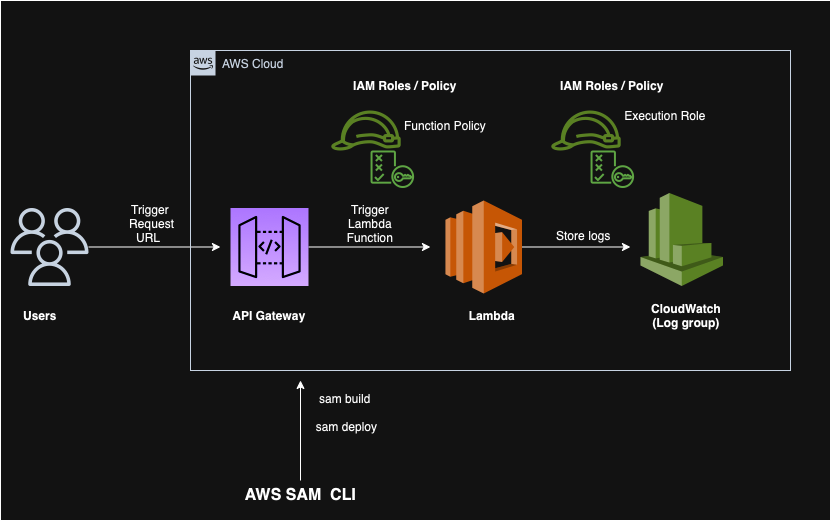

# spring-boot-serverless API



The spring-boot-serverless project, created with [`aws-serverless-java-container`](https://github.com/awslabs/aws-serverless-java-container).

The project defines simple CRUD operations on `/posts` resource. The `posts` collection is populated at runtime via [JSONPlaceholder](https://jsonplaceholder.typicode.com)

The project folder also includes a `template.yml` file. You can use this [SAM](https://github.com/awslabs/serverless-application-model) file to deploy the project to AWS Lambda and Amazon API Gateway or test in local with the [SAM CLI](https://github.com/awslabs/aws-sam-cli). 

## Pre-requisites
* [AWS CLI](https://aws.amazon.com/cli/)
* [SAM CLI](https://github.com/awslabs/aws-sam-cli)
* [Maven](https://maven.apache.org/)
* [JDK17](https://www.oracle.com/in/java/technologies/downloads/#java17)

## Building the project
You can use the SAM CLI to quickly build the project
```bash
$ mvn archetype:generate -DartifactId=spring-boot-serverless -DarchetypeGroupId=com.amazonaws.serverless.archetypes -DarchetypeArtifactId=aws-serverless-jersey-archetype -DarchetypeVersion=2.0.0-M2 -DgroupId=com.nikhil -Dversion=0.0.1-SNAPSHOT -Dinteractive=false
$ cd spring-boot-serverless
$ sam build
Building resource 'SpringBootServerlessFunction'
Running JavaMavenWorkflow:CopySource
Running JavaMavenWorkflow:MavenBuild
Running JavaMavenWorkflow:MavenCopyDependency
Running JavaMavenWorkflow:MavenCopyArtifacts

Build Succeeded

Built Artifacts  : .aws-sam\build
Built Template   : .aws-sam\build\template.yaml

Commands you can use next
=========================
[*] Validate SAM template: sam validate
[*] Invoke Function: sam local invoke
[*] Test Function in the Cloud: sam sync --stack-name {{stack-name}} --watch
[*] Deploy: sam deploy --guided
```

## Testing locally with the SAM CLI

From the project root folder - where the `template.yml` file is located - start the API with the SAM CLI.

```bash
$ sam local start-api

...
Mounting SpringBootServerlessFunction at http://127.0.0.1:3000/{proxy+} [DELETE, GET, HEAD, OPTIONS, PATCH, POST, PUT]
You can now browse to the above endpoints to invoke your functions. You do not need to restart/reload SAM CLI while working on your functions, changes will
be reflected instantly/automatically. If you used sam build before running local commands, you will need to re-run sam build for the changes to be picked
up. You only need to restart SAM CLI if you update your AWS SAM template
WARNING: This is a development server. Do not use it in a production deployment. Use a production WSGI server instead.
 * Running on http://127.0.0.1:3000
Press CTRL+C to quit
...
```

Using a new shell, you can send a test request to the API:

```bash
$ curl -s http://127.0.0.1:3000/api/posts/2 | python -m json.tool
{
    "id": 2,
    "title": "qui est esse",
    "body": "est rerum tempore vitae\nsequi sint nihil reprehenderit dolor beatae ea dolores neque\nfugiat blanditiis voluptate porro vel nihil molestiae ut reiciendis\nqui aperiam non debitis possimus qui neque nisi nulla"
}
``` 

## Deploying to AWS
To deploy the application in your AWS account, you can use the SAM CLI's guided deployment process and follow the instructions on the screen

```bash
$ sam deploy --guided
```

Once the deployment is completed, the SAM CLI will print out the stack's outputs, including the new application URL. You can use `curl` or a web browser to make a call to the URL

```
-------------------------------------------------------------------------------------
Outputs
-------------------------------------------------------------------------------------
Key                 SpringBootServerlessApi
Description         URL for application
Value               https://xxxxxxx.execute-api.ap-south-1.amazonaws.com/Prod/api/posts
-------------------------------------------------------------------------------------
```

Copy the `OutputValue` into a browser or use curl to test your first request:

```bash
$ curl -s https://xxxxxxx.execute-api.ap-south-1.amazonaws.com/Prod/api/posts/2 | python -m json.tool

{
    "id": 2,
    "title": "qui est esse",
    "body": "est rerum tempore vitae\nsequi sint nihil reprehenderit dolor beatae ea dolores neque\nfugiat blanditiis voluptate porro vel nihil molestiae ut reiciendis\nqui aperiam non debitis possimus qui neque nisi nulla"
}
```
